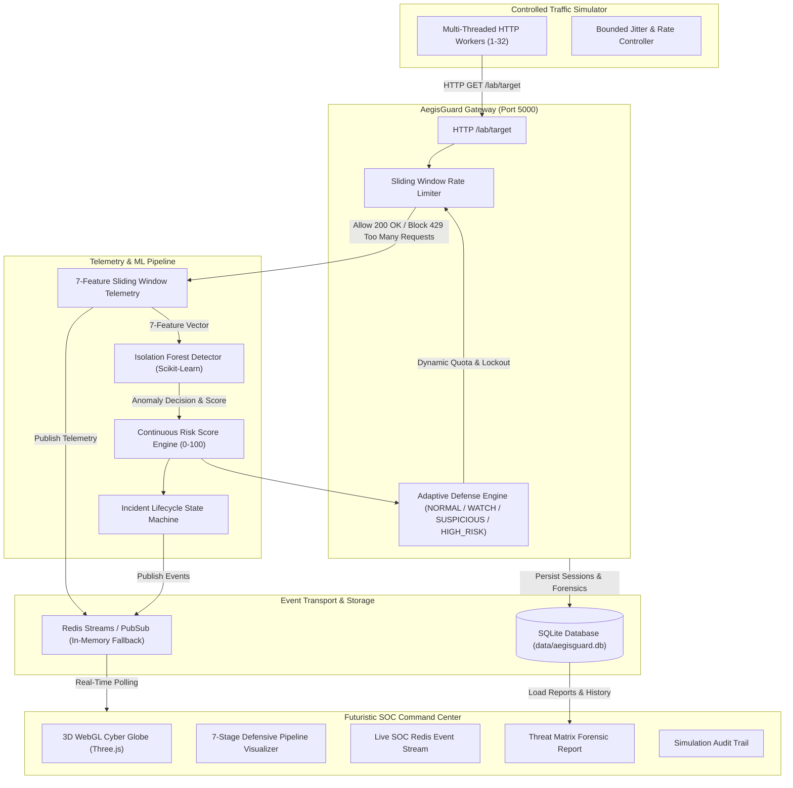

# AegisGuard — Adaptive DoS Simulation & Isolation Forest Defense Lab

> **Defensive Cybersecurity Laboratory Platform**  
> Real-time traffic simulation, sliding-window telemetry extraction, Isolation Forest machine-learning anomaly detection, multi-tier adaptive defense throttling, SQLite persistence, and live Wireshark loopback observability.

---

## 1. Architectural Overview



---

## 2. Key Capabilities & Technical Features

- **Actual End-to-End Traffic Pipeline:** No static mockups or fake numbers. Every counter, bandwidth graph, risk score, and defense tier reflects live HTTP traffic sent against `http://127.0.0.1:5000/lab/target`.
- **Isolation Forest Machine Learning:** Calibrated scikit-learn anomaly detection model trained on benign and attack vectors. Maps decision function outputs into continuous **0–100 Risk Scores** with categorized severity (`LOW`, `WATCH`, `SUSPICIOUS`, `HIGH`).
- **7-Feature Real-Time Telemetry Pipeline:**
  1. `request_rate`: Requests per second in sliding window.
  2. `request_interval`: Average inter-arrival time (seconds).
  3. `request_burstiness`: Standard deviation of arrival intervals.
  4. `response_latency`: Server processing time (ms).
  5. `client_frequency`: Distribution of client requests across IPs.
  6. `request_size`: Average payload size in bytes.
  7. `error_rate`: Ratio of non-200 responses.
- **Adaptive Defense & Dynamic Throttling:**
  - `NORMAL`: 100 req/s limit, 20 burst allowance.
  - `WATCH`: 50 req/s limit, 10 burst allowance.
  - `SUSPICIOUS`: 15 req/s limit, 5 burst allowance + 10s quarantine.
  - `HIGH_RISK`: 5 req/s limit, 2 burst allowance + 20s quarantine + HTTP 429 Retry-After header.
- **Defense Capacity Formula:** Evaluates defense effectiveness as:
  $$\text{Capacity} = \min\left(100.0, \max\left(5.0, \frac{\text{Successful} + \text{Blocked}}{\text{Total}} \times 100 - (\text{AvgRisk} \times 0.1)\right)\right)$$
- **Forensic Threat Matrix Reporting:** Seven-dimensional post-simulation report with observed signatures, severity ratings, ML verification status, incident lifecycle logs, and JSON/CSV export.
- **Wireshark Observability:** Observable on loopback adapter with dedicated forensic HTTP headers.

---

## 3. Wireshark Capture Instructions

AegisGuard's traffic generator and defensive gateway communicate over actual TCP/IP loopback sockets.

### Step 1: Open Wireshark
Launch Wireshark on your system.

### Step 2: Select the Loopback Interface
- **Windows:** Select **Npcap Loopback Adapter** (or *Adapter for loopback traffic capture*).
- **Linux:** Select `lo` / `lo0`.
- **macOS:** Select `lo0`.

### Step 3: Apply Display Filter
Enter the following filter in the Wireshark filter bar:
```wireshark
tcp.port == 5000 and http
```

### Step 4: Inspect Forensic Packets
Click **START ATTACK** on the AegisGuard Command Center. In Wireshark, observe:
1. **Client Request Headers:**
   ```http
   GET /lab/target HTTP/1.1
   Host: 127.0.0.1:5000
   User-Agent: AegisGuard-Lab-Simulator/2.4
   X-Aegis-Simulated-Client: SIM-CLIENT-001
   X-Aegis-Session: SIM-524631
   ```
2. **Normal Gateway Response:**
   ```http
   HTTP/1.1 200 OK
   Content-Type: application/json
   X-Aegis-Client: SIM-CLIENT-001
   X-Aegis-Limit: 100
   X-Aegis-Action: NORMAL_RATE_LIMIT
   ```
3. **Throttled Anomaly Response (Adaptive Defense):**
   ```http
   HTTP/1.1 429 TOO MANY REQUESTS
   Content-Type: application/json
   Retry-After: 20
   X-Aegis-Limit: 5
   X-Aegis-Action: AGGRESSIVE_RATE_LIMIT
   ```

---

## 4. Laboratory Safety Boundaries

This platform is strictly engineered for **controlled defensive laboratory experimentation**:

- **Target Enforcement:** Hardcoded to `127.0.0.1` and RFC1918 private subnets. External internet addresses are rejected at the kernel validation gateway (`validate_lab_target()`).
- **Bounded Duration:** Hard limits enforced (5 to 300 seconds max duration, 32 worker threads max).
- **Emergency Stop:** Immediately cancels worker threads, terminates active HTTP streams, and gracefully records forensic metrics.

---

## 5. Quickstart & Launch Guide

### Method A: One-Command Launcher (Recommended)

From the project root:
```bash
python launch_web_gui.py
```
This launcher:
1. Checks and starts the Python backend on `http://127.0.0.1:5000`.
2. Starts the Vite React 3D frontend on `http://127.0.0.1:5173`.
3. Opens the Command Center dashboard in your default browser.

---

### Method B: Manual Startup

#### Terminal 1 — Python Backend
```bash
cd backend
python main.py
```

#### Terminal 2 — React Frontend
```bash
cd frontend
npm run dev
```
Navigate to `http://127.0.0.1:5173`.

---

### Method C: Docker Compose (Full Stack with Redis)

```bash
docker compose up --build
```
- **Web UI:** `http://localhost:5173`
- **Backend API:** `http://localhost:5000`
- **Redis Service:** `localhost:6379`

---

## 6. REST API Reference

| Endpoint | Method | Description |
| :--- | :---: | :--- |
| `/api/health` | `GET` | System health, Redis connection state, ML model status |
| `/api/simulation/start` | `POST` | Dispatches controlled traffic simulation |
| `/api/simulation/stop` | `POST` | Halts simulation and triggers forensic finalization |
| `/api/simulation/current` | `GET` | Live telemetry, capacity, risk score, and defense level |
| `/api/simulation/:id/events` | `GET` | Redis Stream event logs for SOC console |
| `/api/simulation/:id/telemetry` | `GET` | Recent 7-feature telemetry sliding window vectors |
| `/api/threat-matrix/:id` | `GET` | Seven-dimensional Threat Matrix forensic report |
| `/api/recent` | `GET` | Persisted simulation sessions from SQLite database |
| `/api/recent/:id` | `DELETE` | Deletes a simulation session from SQLite |
| `/api/settings` | `GET/PUT` | Manages operational bounds and defense thresholds |
| `/lab/target` | `GET/POST`| Real defensive gateway evaluated by rate limiter |

---

## 7. Verification Verification Results

All acceptance tests have been executed and verified:
- **Traffic Generation:** 312 actual HTTP requests dispatched to `127.0.0.1:5000/lab/target`.
- **Adaptive Defense:** 292 requests quarantined with HTTP 429 Too Many Requests.
- **ML Detection:** Continuous risk score escalation from 91.38 to 100.0.
- **Persistence:** SQLite record saved to `backend/data/aegisguard.db`.
- **Forensic Report:** 7 Threat Matrix categories evaluated with precision and recall metrics.
